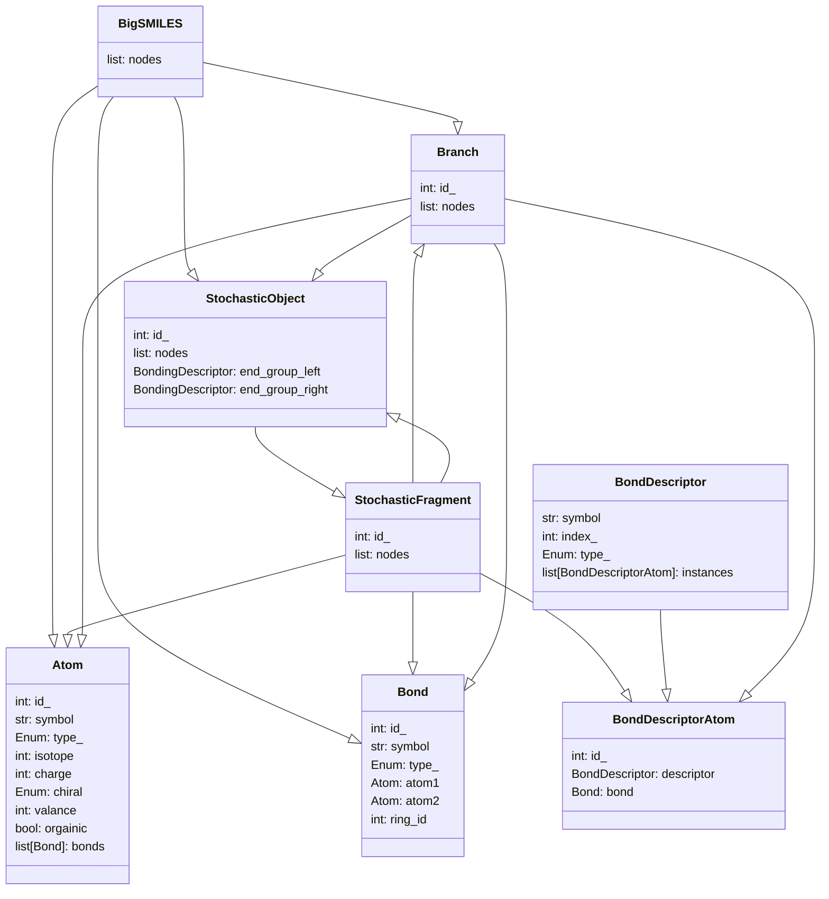

# BigSMILES Parser

---
---


**(still under development; but usable)**

SMILES (simplified molecular-input line-entry system) representation is a line notation for molecules with 
given deterministic molecular structures. **BigSMILES** is an extension to SMILES which provides support for molecules 
that contain stochastic molecular structures. The code here parses the string into and abstract syntax tree.

[Learn more about BigSMILES Notation](https://olsenlabmit.github.io/BigSMILES/docs/line_notation.html#the-bigsmiles-line-notation)


---

## Installation

Pip installable package available

`pip install bigsmiles`

[pypi: bigsmiles](https://pypi.org/project/bigsmiles/)


---

## Requirements / Dependencies
Python 3.10+


---

## Basic Usage

### Print Tree
#### Code:
```python
import bigsmiles

polymer_string = "CC{[>][<]CC(C)[>][<]}CC(C)=C"
polymer = bigsmiles.BigSMILES(polymer_string)
polymer.print_tree()
```

#### Output:
```python
BigSMILES: CC{[>][<]CC(C)[>][<]}CC(C)=C
├── Atom: C
├── Bond: 
├── Atom: C
├── Bond: 
├── StochasticObject: {[>][<]CC(C)[>][<]}
│    └── StochasticFragment: [<]CC(C)[>]
│        ├── BondDescriptorAtom: [<]
│        ├── Bond: 
│        ├── Atom: C
│        ├── Bond: 
│        ├── Atom: C
│        ├── Branch: (C)
│        │    ├── Bond: 
│        │    └── Atom: C
│        ├── Bond: 
│        └── BondDescriptorAtom: [>]
├── Bond: 
├── Atom: C
├── Bond: 
├── Atom: C
├── Branch: (C)
│    ├── Bond: 
│    └── Atom: C
├── Bond: =
└── Atom: C
```

---
---

## Abstract Syntax Tree

root node: `BigSMILES` 

intermediate nodes: `StochasticObject`, `StochasticFragment`, `Branch`

leaf nodes: `BondDescriptorAtom`, `Atom`, `Bond`

The tree structure is built through the `nodes` attribute.

**Note:** only main attributes shown in diagram below.



---
---

## Advanced Options

### Colored outputs
```python
import bigsmiles

bigsmiles.Config.color_output = True
```

BigSMILES: CC
<span style="color:red">{</span>
<span style="color:green">[>]</span>
<span style="color:green">[<]</span>
CC(C)
<span style="color:green">[>]</span>
<span style="color:green">[<]</span>
<span style="color:red">}</span>
CC(C)=C


## Features NOT implemented yet
* Cis/Trans
* Fragment Notation
* ladder polymers
* mixture notation '.'
* reactions
* Validation
  * Some is present; but more needed:
    * Validate bonding descriptors matching including endgroups

