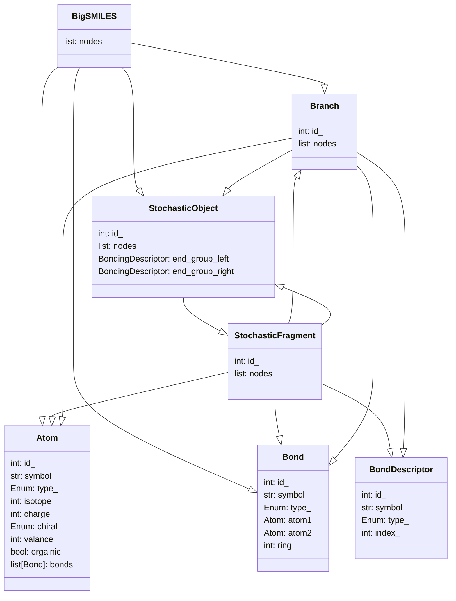

# BigSMILES Parser

SMILES (simplified molecular-input line-entry system) representation is a line notation for molecules with 
given deterministic molecular structures.

BigSMILES is an extension to SMILES which provides support for molecules that contain stochastic molecular structures. 

[Learn more about BigSMILES Notation](https://olsenlabmit.github.io/BigSMILES/docs/line_notation.html#the-bigsmiles-line-notation)

---

## Installation

Pip installable package available

`pip install bigsmiles`

[pypi: bigsmiles](https://pypi.org/project/bigsmiles/)


---

## Requirements / Dependencies
Python 3.10+


---

## Basic Usage

### Print Tree
#### Code:
```python
import bigsmiles

polymer_string = "CC{[>][<]CC(C)[>][<]}CC(C)=C"
polymer = bigsmiles.BigSMILES(polymer_string)
polymer.print_tree()
```

#### Output:
```python
BigSMILES: CC{[>][<]CC(C)[>][<]}CC(C)=C
├── Atom: C
├── Bond: 
├── Atom: C
├── Bond: 
├── StochasticObject: {[>][<]CC(C)[>][<]}
│    └── StochasticFragment: [<]CC(C)[>]
│        ├── BondDescriptor: [<]
│        ├── Bond: 
│        ├── Atom: C
│        ├── Bond: 
│        ├── Atom: C
│        ├── Branch: (C)
│        │    ├── Bond: 
│        │    └── Atom: C
│        ├── Bond: 
│        └── BondDescriptor: [>]
├── Bond: 
├── Atom: C
├── Bond: 
├── Atom: C
├── Branch: (C)
│    ├── Bond: 
│    └── Atom: C
├── Bond: =
└── Atom: C
```

---

## Abstract Syntax Tree


