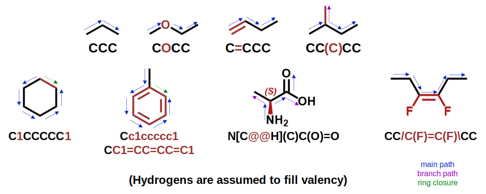

---

## High level

Molecules can be represented at a graph (nodes, edges). Nodes represent atoms, and edges represent bonds. 
In the context of BigSMILES, polymer can similarly be view as a graph.

The construction of a SMILES string involves choosing a starting atom (any atom is a valid starting point) and traverse
the molecule where the traversal path becomes 

