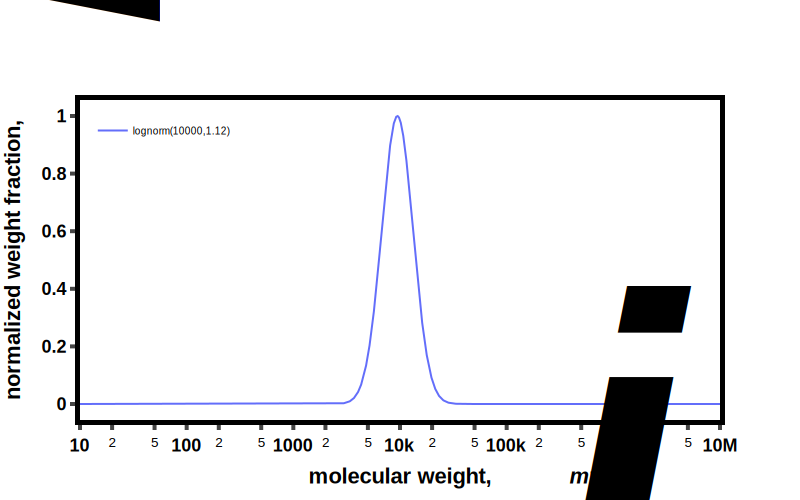

---

**Polymers are inherently stochastic.** The stochastic nature of these chemical structures stems from the statistical 
chemical reactions that are used to produce them. This stochasticity brings about distributions in molecular 
mass, composition, and topology. A combination of structural descriptors (like a chemical drawing) and 
distribution information is therefore required to fully define the molecular structure. 


There are two class of molecular weight distributions available:

<u>**Continuous**</u>

* The chain length takes on **real number values**; i.e. chain length is treated as continuum with fractional chain 
  lengths allowed.
* `mw_i` vs. `x_i` or `mw_i` vs. `w_i`
  
<u>**Discrete**</u>

  * The chain length takes on **integer values**;  molecular weight distribution has discrete lengths. 
  * `N_i` vs. `x_i_pmd`
  
While these two types of distributions are treated separately; if `repeat_MW` is provided; both continouse and discrete
distributions are interconvertible. 


Supported distributions include:

**ContinuousDistribution**

* LogNormal
* SchulzZimm
* Gaussian
* Uniform
* Custom (provide your own data)

**DiscreteDistribution**

* Poisson
* FlorySchulz

For more information: [Distribution][bigsmiles.distributions.base.Distribution] 


## Creating a distribution

The following example is for a living polymerization of styrene (molecular weight = 104.15 g/mol) which yielded
a polymer with a number average molecular weight (Mn) of 10,000 g/mol and a molecular weight dispersity (D) of 1.02.

`repreat_MW` is optional, but is necessary to calculate multiple properties with will return None if not provided. 

```python
import bigsmiles.distributions 

dis = bigsmiles.distributions.LogNormal(Mn=10_000, D=1.02, repeat_MW=104.15)

```


## Calculation properties (Mn, Mw, D, skew, etc.)

Values will return `None` if they can't be computed.

```python
print('Mn: ', dis.Mn)   # Mn:  10000
print('Mw: ', dis.Mw)  # Mw:  11200.000000000002
print('D: ', dis.D)  # D:  1.12
print('skew in mw: ', dis.skew_mw)  # skew in mw:  1.0808555387469934
print('standard deviation in mw: ', dis.std_mw)  # standard deviation in mw:  3464.1860059222045
print('kurtosis in mw: ', dis.kurtosis_mw)  # kurtosis in mw:  2.1464750034824585
print('peak mw: ', dis.peak_mw) # peak mw:  10000.0
print('chain length', dis.N)  # chain length 96.01536245799328
```


## Plotting

BigSMILES package supports very basic visualization mainly for debugging and quick checks of data. There are several
available functions for plotting distributions. Just pass the distribution into the desired function.

Plotly figure will be returned.

```python
fig = bigsmiles.distributions.plot_w_i(dis)
fig.show()
```



Plotting function:

* `plot_x_i`
* `plot_x_i_pmd`
* `plot_w_i`
* `plot_x_i_cdf`
* `plot_w_i_cdf`

## Custom Distribution

Custom distributions can be defined by passing either `mw_i` and `x_i` or `mw_i` and `w_i` into `CustomDistribution`.

To deal with numerical challenges any 'y' value < 2% of max 'y' value will be set to zero. 
(see [CustomDistribution][bigsmiles.distributions.continuous.CustomDistribution] for more details)

```python
import numpy as np
import bigsmiles.distributions 

data = np.genfromtxt("../../../examples/data/GPC_data.csv", delimiter=',')
dis = bigsmiles.distributions.CustomDistribution(mw_i=data[:, 0], w_i=data[:, 1])
```
