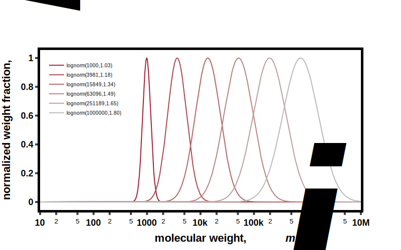
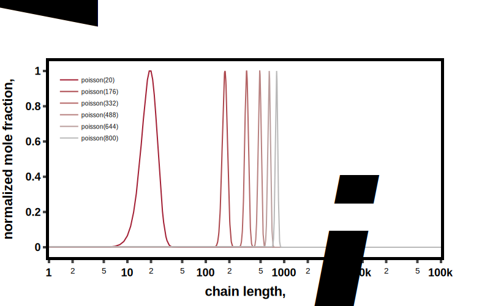
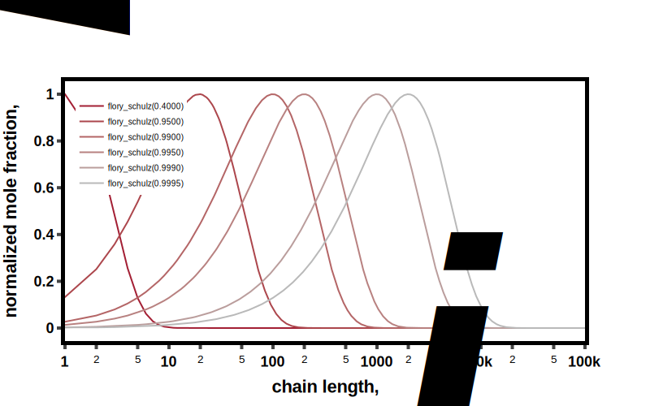

---

## Continuous Distributions (based on molecular weight)

### Log Normal Distribution

::: bigsmiles.data_structures.distributions.LogNormal

### Schulz Zimm Distribution

::: bigsmiles.data_structures.distributions.SchulzZimm

### Gaussian Distribution (Normal Distribution)

::: bigsmiles.data_structures.distributions.Gauss

### Uniform Distribution

::: bigsmiles.data_structures.distributions.Uniform

### Custom Distribution

::: bigsmiles.data_structures.distributions.CustomDistribution

---

## Discrete Distributions (based on chain length)

### Poisson Distribution

::: bigsmiles.data_structures.distributions.Poisson

---

### Flory Schulz Distribution

::: bigsmiles.data_structures.distributions.FlorySchulz

---

