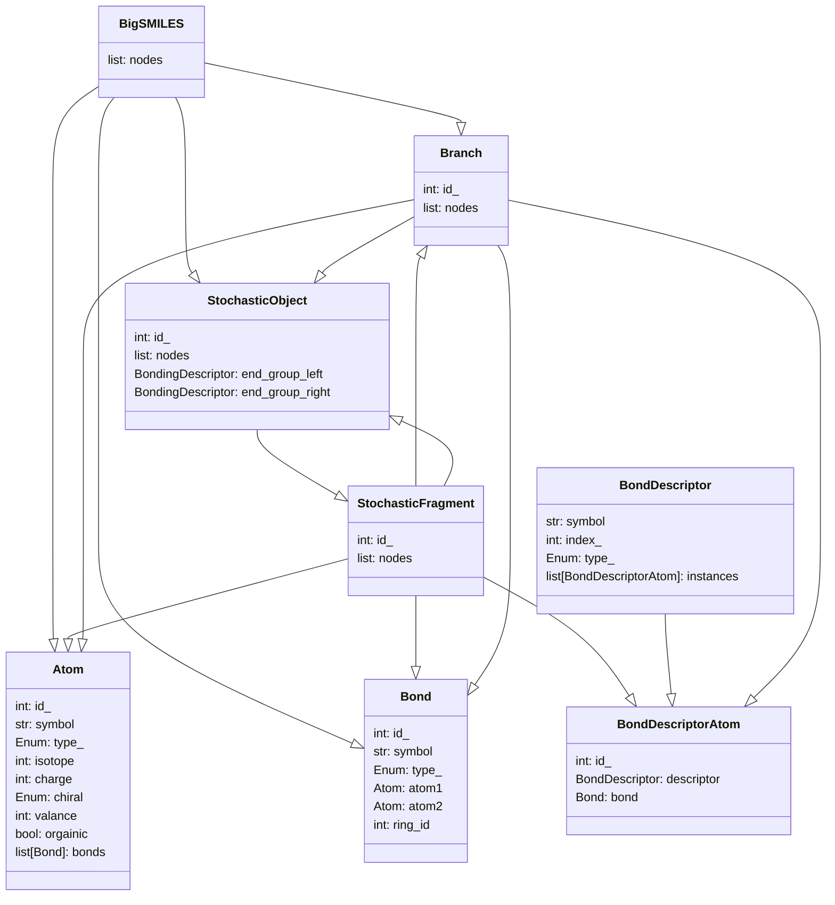

## Abstract Syntax Tree

root node: `BigSMILES` 

intermediate nodes: `StochasticObject`, `StochasticFragment`, `Branch`

leaf nodes: `BondDescriptorAtom`, `Atom`, `Bond`

BigSMILE objects (`Atom`, `Bond`, `BondingDescriptor`, `Branch`, `StochasticFragment`, `StochasticObject`, `BigSMILES`) 
only holds data. Creation of these objects are handled by the `Constructor`.

