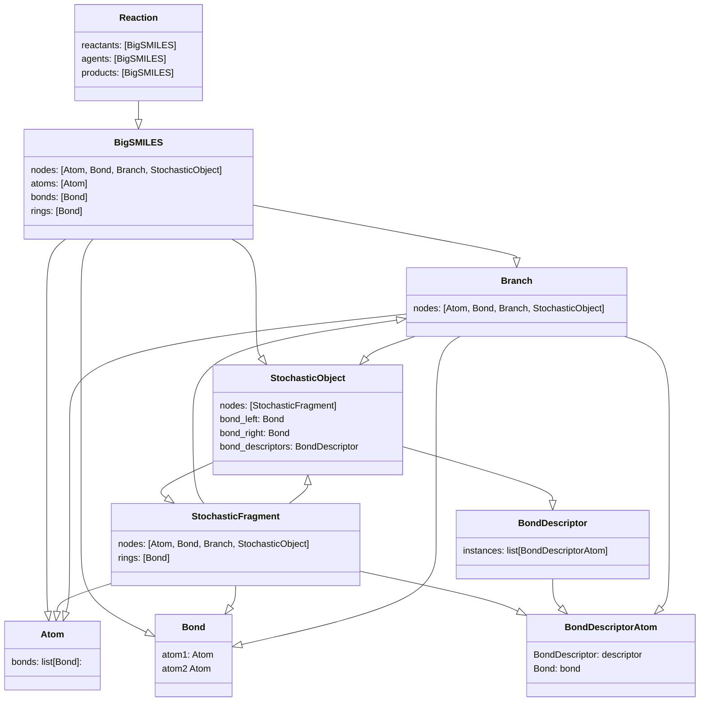

The BigSMILES will be parsed into an abstract syntax tree. There are 3 classes of nodes:

* root node: `BigSMILES`
* intermediate nodes: `StochasticObject`, `StochasticFragment`, `Branch`
* leaf nodes: `BondDescriptorAtom`, `Atom`, `Bond`

BigSMILE objects (`Atom`, `Bond`, `BondingDescriptor`, `Branch`, `StochasticFragment`, `StochasticObject`, `BigSMILES`) 
only holds data. 

!!! info
    Creation of these objects are handled by the 'Constructor' methods.

<b>
The figure shows the data objects and links to other data objects. 
The arrows point from 'parent' objects to 'child' objects. Meaning `Reaction` --> `BigSMILES` means that you will 
find attributes in `Reaction` that are `BigSMILES` objects.

</b>

