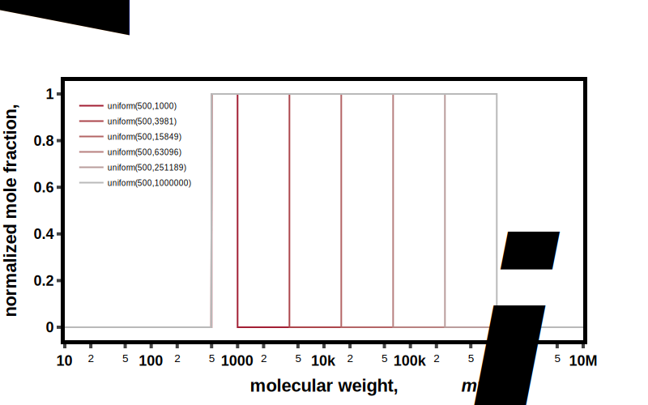
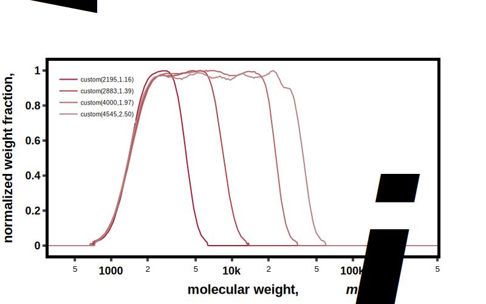

# Continuous Distributions (based on molecular weight)
---

::: bigsmiles.distributions.continuous.DistributionContinuous

---

::: bigsmiles.distributions.continuous.LogNormal

::: bigsmiles.distributions.continuous.SchulzZimm

::: bigsmiles.distributions.continuous.Gaussian

::: bigsmiles.distributions.continuous.Uniform

::: bigsmiles.distributions.continuous.CustomDistribution

(data from: [https://doi.org/10.1038/s41467-020-16874-6](https://doi.org/10.1038/s41467-020-16874-6))