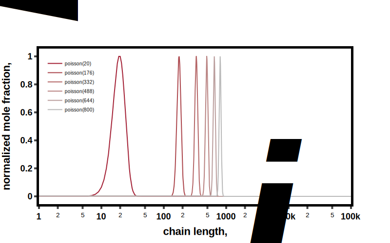
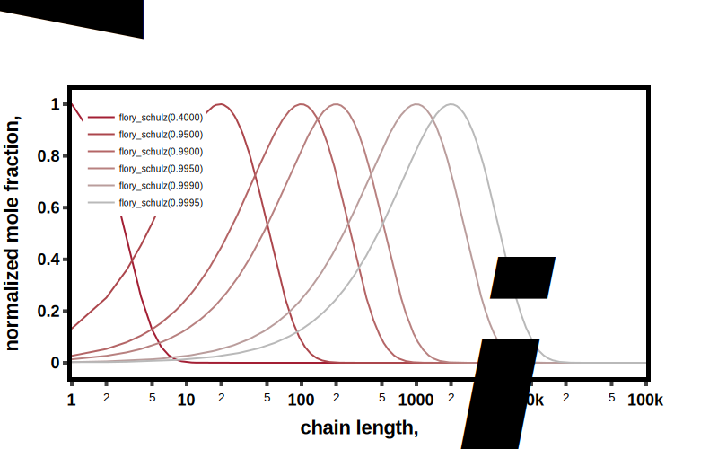

# Discrete Distributions (based on chain length)
---

::: bigsmiles.distributions.discrete.DistributionDiscrete

---

::: bigsmiles.distributions.discrete.Poisson

::: bigsmiles.distributions.discrete.FlorySchulz

