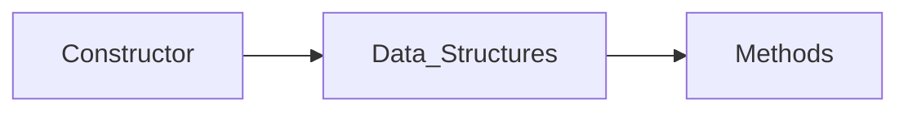

# Overview

---

** The code is organized in to 3 main groups: **

!!! info "Data Structures"
    Objects that hold data.

    **<ins>Examples</ins>**

    * Atom
    * Bond
    * Bonding Descriptor

!!! info "Methods"
    Functions that can transform, compute, display, etc. things about the data structure.

    **<ins>Examples</ins>**

    * Parse Tree
    * Graph
    * Fingerprint

!!! info "Constructor"
    Functions that can be used to construct data structures.

    **<ins>Examples</ins>**

    * add_atom()
    * add_bond()
    * insert_branch()

---

** The typical flow of data through the code is: **

Note: the constructor is often called from the data_structure. Specifically, BigSMILES will pass the BigSMILES string 
to the constructor to create itself.

