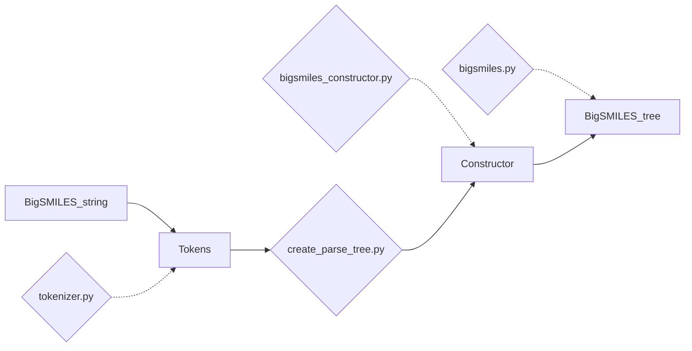

# How the code works

## High level

The code will take a BigSMILES string as an input. The first step is to tokenize the string
with regex. The tokens are then passed into a `create_parse_tree.py` which will assemble the 'BigSMILES tree' by using
`Constructor`.

BigSMILE objects (`Atom`, `Bond`, `BondingDescriptor`, `Branch`, `StochasticFragment`, `StochasticObject`, `BigSMILES`) 
only holds data. Creation of these objects are handled by the `Constructor`.

Order of creating objects: 
* Read left to right 
1) Add first symbol (`Atom`)
2) Add bond and atom together
   1) If bond not present (i.e. it is a single bond) add it manually. 

